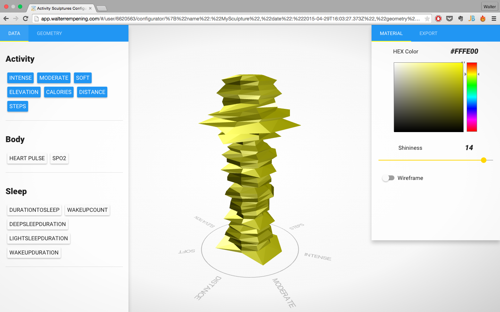
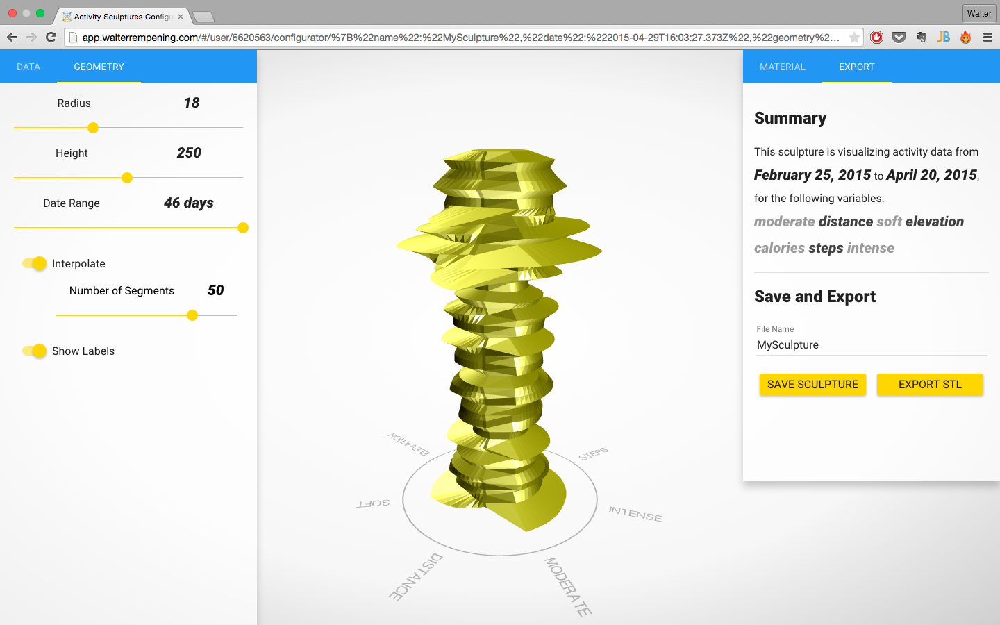
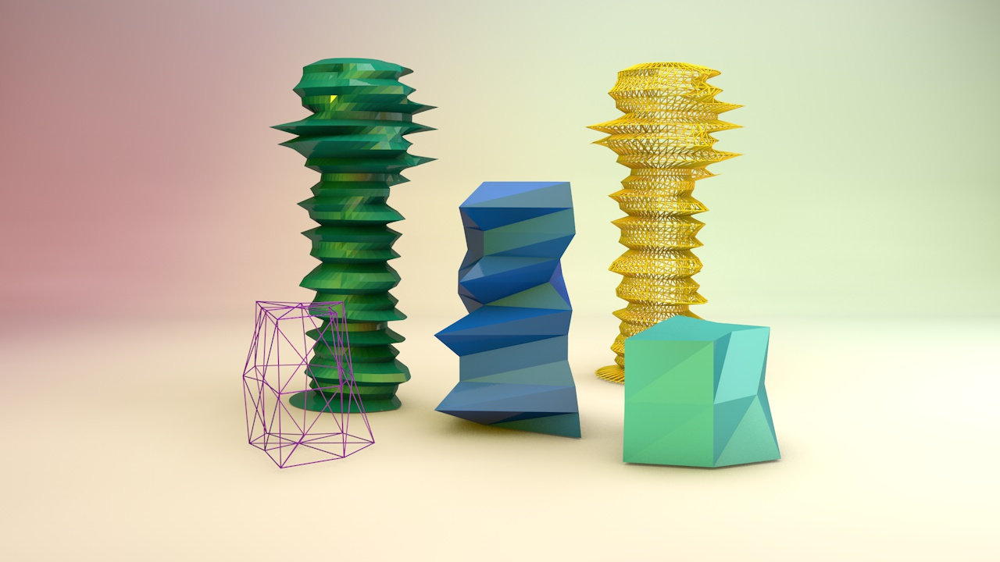
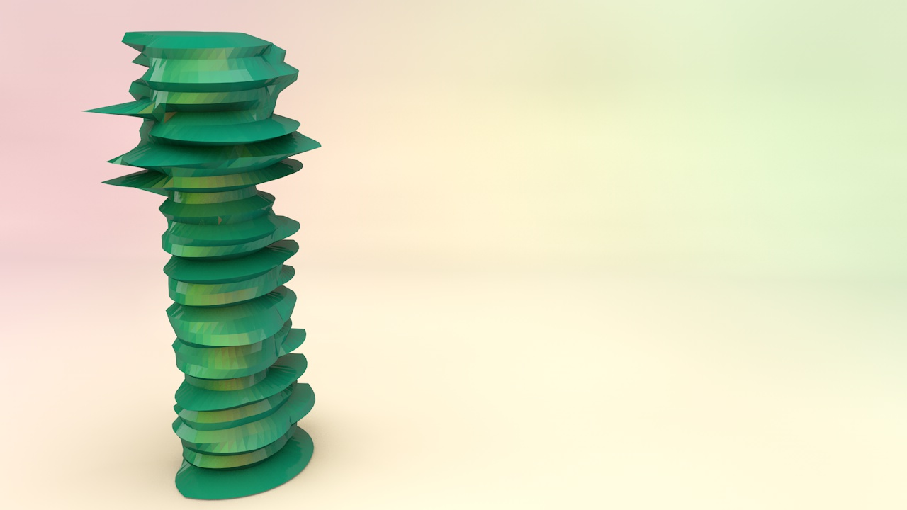
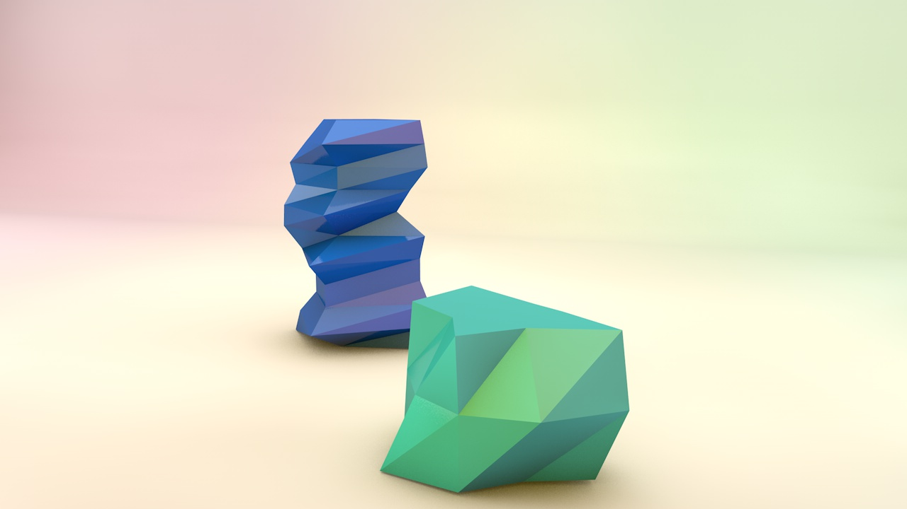
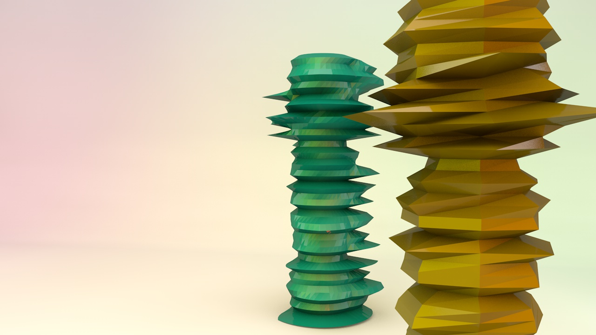
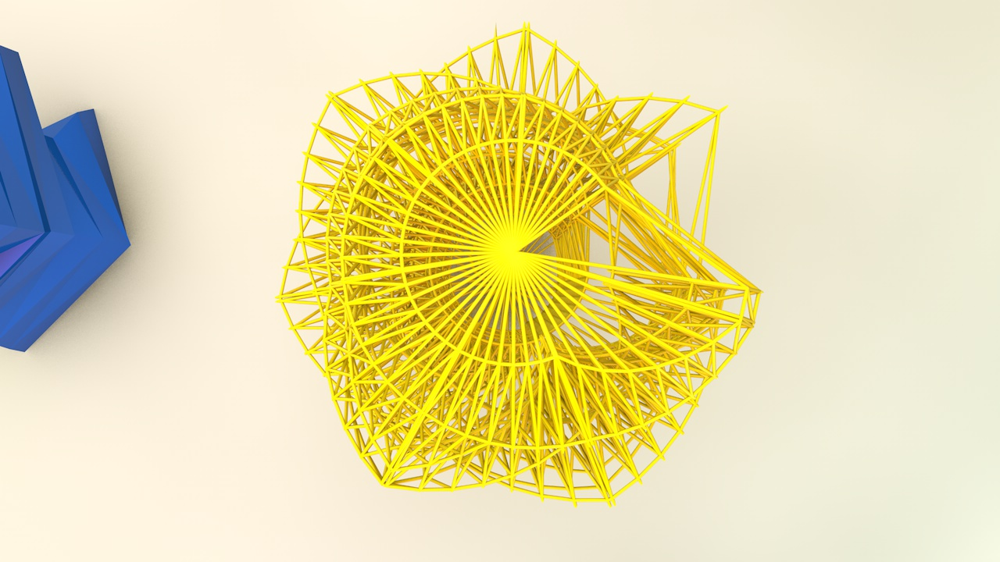

# Web-Based Creator for Activity Sculptures #

## Motivation for the project ##
The recollection of personal activity data has been greatly facilitated by the increasing amount of applications and devices that encourage users to measure their activity with the primary goal of health improvement. These devices range from mobile applications taking advantage of smart- phone sensors to dedicated fitness trackers presented as modern watches and bracelets. Apart from the analytical insights about the data obtained through classic data visualizations, it is also possible to visualize the information through physical objects also known as activity sculptures. It has been shown that activity sculptures have a positive influence in users making them feel re- warded for their active lifestyle. To further study the process of visualizing activity information into sculptures a web-based activity sculpture creator was developed. This tool takes advantage of modern web technologies and offers a platform in which users can import their data and allows them to experiment creating variations of an activity sculpture which can also be exported for 3D printing. For the development of the configurator current product customization platforms were analyzed for gathering best practices in user interface and interaction design. In order for users to have a sculpture with a high degree of data mapping variability, 4 different sculpture prototypes were developed. For the validation of the configurator an online version was released and a user study was performed. User feedback showed that our prototype was easy to operate and that the obtained sculptures were appealing and meaningful to them.

## Motivation für das Projekt ##
Die Sammlung persönlicher Aktivitätsdaten wurde durch die zahlreiche Anzahl an Anwendun- gen und Geräte enorm vereinfacht. Diese Anwendungen und Gerätschaften, die hauptsächlich das Ziel haben, Nutzer zu einem aktiven Lebensstil zu ermutigen, können in Smartphones, wo sie die Vielfalt an Sensoren ausnutzen, oder als tragbare Accessoires wie moderne Uhren oder Arm- bänder gefunden werden. Abgesehen davon, dass klassische Datenvisualisierungen Einblicke in die Aktivitätsdaten verschaffen können, ist es auch möglich den Datensatz durch physikalische Objekte, auch als Aktivitätsskulpturen bekannt, zu visualisieren. Es wurde bewiesen, dass Aktivi- tätsskulpturen Nutzer positiv beeinflussen, da die Nutzer sich für ihren aktiven Lebensstil belohnt fühlen. Um den Prozess der Visualisierung von Information in Skulpturen weiter zu erforschen wurde ein Web-Konfigurator für Aktivitätsskulpturen entwickelt. Durch die Nutzung moderner Web-Technologien erhält der Nutzer eine Platform die es ihm erlaubt, seine Daten unkompliziert zu importieren und ihm die Gestaltung einer 3D druckbaren Skulptur ermöglicht. Für die Entwick- lung des Konfigurators wurden aktuelle Konfiguratoren analysiert mit dem Ziel Best-Practices im Bereich des Interface- und Interaktionsdesigns zu sammeln. Um dem Nutzer eine breite Vielfalt an möglichen Anpassungen für die Skulptur zu ermöglichen, wurden 4 verschiedene Skulptur- Prototypen entwickelt. Letztendlich wurden für die Validierung des Prototyps eine online Demo- version veröffentlicht und eine Nutzerstudie durchgeführt. Die Resonanz der Nutzer zeigte, dass der Prototyp einfach zu bedienen ist und, dass die entstandene Skulptur ansprechend und sinnvoll war.

Features:
  * Entirely coded in JavaScript with the MEAN stack
  * Easiley import activity data through the Withings API
  * Offer activity data overview
  * User friendly configurator
  * Generate 3D sculpture from the data
  * Wide range of controls for customization
  * Export sculpture to .stl for 3D print

Try it online: [app.walterrempening.com](http://app.walterrempening.com) .
You'll need an active Withings account to login. 
See some slides of the final master thesis [presentation](http://slides.com/walterrempeningdiaz/web-based-sculpture-creator)

## Installation Guide ##
1. Clone this repository on your system
2. Install node.js and mongodb
3. Install the node package manger npm and bower
4. From the command line start mongodb with `$ sudo mongod` 
5. In the root folder from the command line run: 
  `$ npm install && bower install`
6. From the command line run `$ node server.js`
7. Open in a browser under http://localhost:3000

