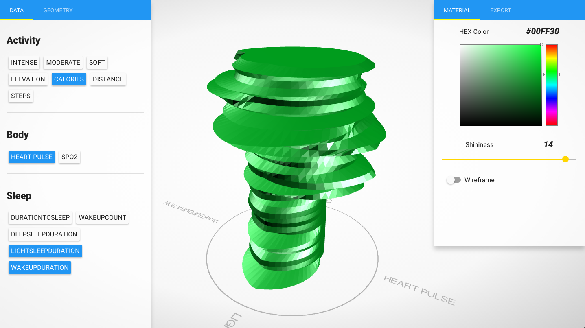
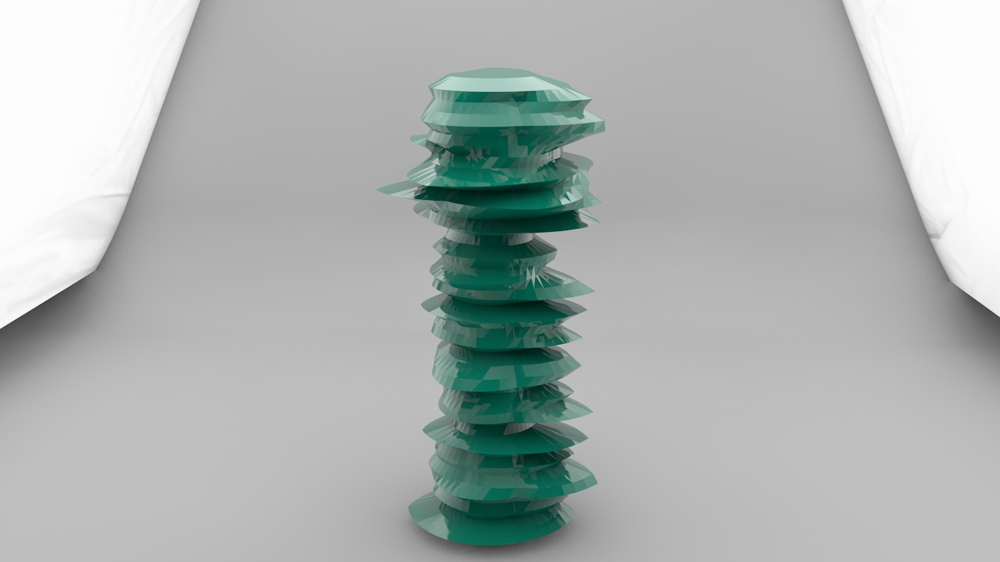

# Web-Based Creator for Activity Sculptures #

## Motivation for the project ##
The recollection of personal activity data has been greatly facilitated by the
increasing amount of applications and devices that encourage users to measure
their activity with the primary goal of health improvement. These
devices range from mobile applications taking advantage of smartphone sensors to
dedicated fitness trackers presented as modern watches and bracelets. Apart from the
analytical insights about the data obtained through classic data
visualizations, it is also possible to visualize the information through
physical objects also known as activity sculptures. It has been shown that
activity sculptures have a positive influence in users and they motivate the
user to keep exercising. To further improve the process of visualizing activity
information into sculptures an activity sculpture web configurator was
developed. This tool takes advantage of modern web
technologies and offers a platform in which users can export their data and
allows them to experiment creating variations of an activity sculpture which can also
be exported for 3D printing. For the development of the configurator actual
product customization platforms where analyzed for gathering best practices in
user interface and interaction design. In order for users to have a sculpture
with a high degree of variability for the data to be mapped on 4 
different sculpture prototypes were developed. For the validation of the
configurator an online version was released and a user study was performed.
User feedback showed that our prototype was easy to operate and that the
obtained sculptures were appealing and meaningful to users.

Features:
  * Entirely coded in JavaScript with the MEAN stack
  * Easiley import activity data through the Withings API
  * Offer activity data overview
  * User friendly configurator
  * Generate 3D sculpture from the data
  * Wide range of controls for customization
  * Export sculpture to .stl for 3D print

Try it online: [app.walterrempening.com](http://app.walterrempening.com) .
You'll need an active Withings account to login.

## Installation Guide ##
1. Clone this repository on your system
2. Install node.js and mongodb
3. Install the node package manger npm and bower
4. From the command line start mongodb with `$ sudo mongod` 
5. In the root folder from the command line run: 
  `$ npm install && bower install`
6. From the command line run `$ node server.js`
7. Open in a browser under http://localhost:3000

